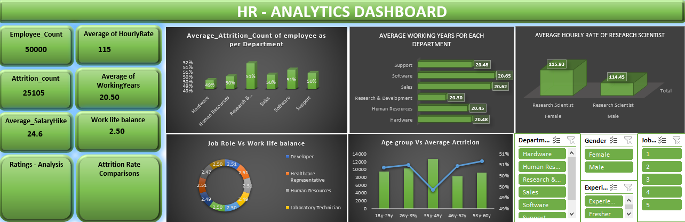
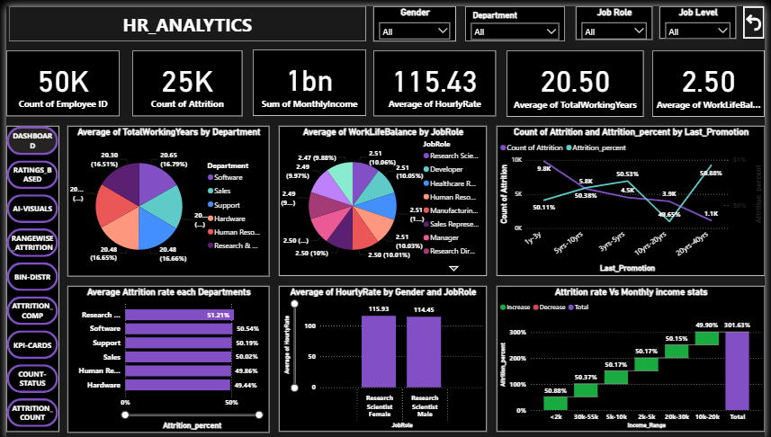
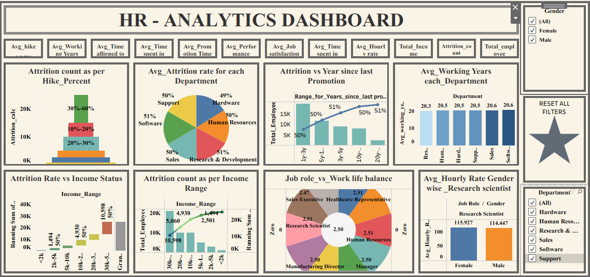

# HR Analytics

## Tools Used
- SQL
- Excel
- Power BI
- Tableau

## Objective
To analyze HR data to understand employee attrition, workforce distribution, and key HR performance metrics, enabling data-driven HR decisions.

## Key KPIs
- Total Employees
- Attrition Rate
- Active Employees
- Average Salary
- Department-wise Attrition
- Gender & Age-wise Analysis

## SQL Analysis
- Data cleaning and validation
- Attrition calculation
- Aggregations and conditional logic
- HR-focused insights

## Dashboards

### Excel Dashboard

### Power BI Dashboard

### Tableau Dashboard

## Outcome
This project provides insights into employee attrition patterns and workforce trends to support better HR decision-making.

